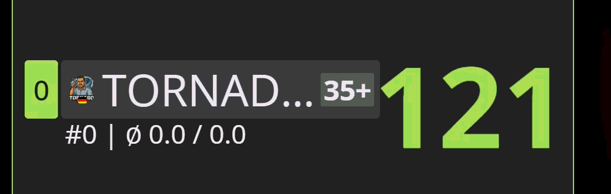

# Autodarts Tampermonkey Themes & Effekte

> Rein visuelle Erweiterungen für Autodarts: bessere Lesbarkeit, klarere Hinweise und optionale Effekte. Keine Änderung an Spiellogik, Scores oder Erkennung.

## Für wen ist das?

Diese Sammlung ist für Spieler, die in Autodarts schneller erfassen wollen, was gerade wichtig ist.
Du kannst Module einzeln aktivieren, kombinieren und direkt in **AD xConfig** anpassen.

## Schnellstart (empfohlen)

1. Tampermonkey installieren: [tampermonkey.net](https://www.tampermonkey.net/index.php?browser=chrome)
2. **AD xConfig Auto Loader** installieren: [Installieren](https://github.com/thomasasen/autodarts-tampermonkey-themes/raw/refs/heads/main/Config/AD%20xConfig%20Auto%20Loader.user.js)
3. Falls Tampermonkey einen Injection-Hinweis zeigt, Developer Mode aktivieren: [FAQ Q209](https://www.tampermonkey.net/faq.php#Q209)
4. `https://play.autodarts.io` öffnen oder neu laden
5. Im Hauptmenü **AD xConfig** öffnen
6. Auf **„🔄 Skripte & Loader-Cache laden“** klicken, Module aktivieren und bei Bedarf unter **⚙ Einstellungen** anpassen

## Warum nur der Auto Loader?

- Eine zentrale Oberfläche statt vieler einzelner Skripte
- Module und Einstellungen an einem Ort
- Updates und Cache-Fallback automatisch
- Kein doppeltes Laden von Skripten

Wichtig: Wenn `Config/AD xConfig.user.js` bereits direkt installiert ist, bitte deaktivieren oder deinstallieren. Nutze nur den Auto Loader.

## Module im Überblick

Hinweis: In AD xConfig gibt es pro Modul die Buttons **📦 Skript**, **📖 README** und **🛠 Technik**.
Die technische Tiefe findest du in der [TECHNIK-REFERENZ](docs/TECHNIK-REFERENZ.md).
Zusatz: Die Option `Debug` ist in vielen Modulen vorhanden und nur für Fehlersuche gedacht.

### 🧱 Templates

### Gemeinsamer Helfer (autodarts-theme-shared.js, kein Userscript)

- Gilt für: `X01`, `Shanghai`, `Bermuda`, `Cricket`, `Bull-off`
- Was macht es sichtbar? Das ist der gemeinsame Unterbau für die Theme-Module.
- Einstellungen: Keine eigenen Einstellungen.
- Technische Details: [Gemeinsamer Helfer (Theme)](docs/TECHNIK-REFERENZ.md#gemeinsamer-helfer-autodarts-theme-sharedjs-kein-userscript)

---

### Template: Autodarts Theme X01

- Gilt für: `X01`
- Was macht es sichtbar? Klarere Struktur für Scores, Spielerkarten und Navigation.
- Wann sinnvoll? Wenn du ein ruhiges, gut lesbares X01-Layout willst.

**Einstellungen einfach erklärt**

- `AVG anzeigen`: Blendet die AVG-Anzeige ein oder aus.
  Vorteil: Mit `An` siehst du deinen Formtrend sofort, mit `Aus` wirkt das Layout ruhiger.

**Vorschau**

DartsZoom-Vorschau:

---

### Template: Autodarts Theme Shanghai

- Gilt für: `Shanghai`
- Was macht es sichtbar? Ordnet die Ansicht klarer und verbessert den Lesefluss.
- Wann sinnvoll? Wenn dir in Shanghai ein aufgeräumteres Layout wichtig ist.

**Einstellungen einfach erklärt**

- `AVG anzeigen`: Blendet die AVG-Anzeige ein oder aus.
  Vorteil: Du kannst Shanghai je nach Geschmack zwischen „mehr Infos“ und „mehr Ruhe“ umschalten.

**Vorschau**

---

### Template: Autodarts Theme Bermuda

- Gilt für: `Bermuda`
- Was macht es sichtbar? Bessere Trennung von wichtigen UI-Bereichen.
- Wann sinnvoll? Wenn du Bermuda einfach aktivieren und ohne Feintuning nutzen willst.

**Einstellungen einfach erklärt**

- Keine zusätzlichen Einstellungen.
  Vorteil: Das Theme ist sofort startklar und braucht kein Feintuning.

**Vorschau**

---

### Template: Autodarts Theme Cricket

- Gilt für: `Cricket`
- Was macht es sichtbar? Ruhigere Darstellung mit klaren Kontrasten für Cricket.
- Wann sinnvoll? Als Basis in Cricket, besonders in Kombination mit Cricket-Animationen.

**Einstellungen einfach erklärt**

- `AVG anzeigen`: Blendet die AVG-Anzeige ein oder aus.
  Vorteil: Mit `An` behältst du deinen Schnitt im Blick, mit `Aus` wirkt Cricket aufgeräumter.

**Vorschau**

---

### Template: Autodarts Theme Bull-off

- Gilt für: `Bull-off`
- Was macht es sichtbar? Klarere Score-Darstellung mit bullfokussierter Farbgebung.
- Wann sinnvoll? Wenn Bull-off auf Distanz besser lesbar sein soll.

**Einstellungen einfach erklärt**

- `Kontrast-Preset`: Steuert, wie kräftig die Kontraste im Bull-off-Theme sind (`Sanft`, `Standard`, `Kräftig`).
  Vorteil: Du kannst die Sichtbarkeit schnell an Monitor, Abstand und Raumlicht anpassen.

**Vorschau**

---

### 🎬 Animationen

### Gemeinsamer Helfer (autodarts-animation-shared.js, kein Userscript)

- Gilt für: alle Animationsmodule
- Was macht es sichtbar? Gemeinsame Basis für Trigger, Beobachtung und robuste Anzeige.
- Einstellungen: Keine eigenen Einstellungen.
- Technische Details: [Gemeinsamer Helfer (Animation)](docs/TECHNIK-REFERENZ.md#gemeinsamer-helfer-autodarts-animation-sharedjs-kein-userscript)

---

### Animation: Autodarts Animate Triple Double Bull Hits

- Gilt für: `alle Modi`
- Was macht es sichtbar? Triple-, Double- und Bull-Treffer springen in der Wurfliste sofort ins Auge.
- Wann sinnvoll? Für Trainingsfokus auf Trefferarten.

**Einstellungen einfach erklärt**

- `Triple hervorheben`: Markiert Triple-Treffer deutlich in der Wurfliste.
  Vorteil: Starke Würfe springen sofort ins Auge.
- `Double hervorheben`: Markiert Double-Treffer deutlich in der Wurfliste.
  Vorteil: Hilft besonders beim Checkout-Fokus.
- `Bull hervorheben`: Markiert Bull-Treffer deutlich in der Wurfliste.
  Vorteil: Du erkennst Bull-Treffer auch im schnellen Spiel sofort.
- `Aktualisierungsmodus`: `Nur Live` reagiert maximal direkt, `Kompatibel` ist robuster bei zäheren Browser-/Systemsituationen.
  Vorteil: Du kannst zwischen maximaler Direktheit und maximaler Stabilität wählen.

**Vorschau**

---

### Animation: Autodarts Animate Single Bull Sound

- Gilt für: `alle Modi`
- Was macht es sichtbar? Kein visuelles Signal, stattdessen ein kurzer Ton bei Single Bull.
- Wann sinnvoll? Wenn du akustisches Feedback möchtest.

**Einstellungen einfach erklärt**

- `Lautstärke`: Legt fest, wie laut der Single-Bull-Sound abgespielt wird (`Leise` bis `Sehr laut`).
  Vorteil: Du bekommst akustisches Feedback, ohne andere Sounds zu überdecken.

**Audio-Vorschau**

- Sound-Datei: [singlebull.mp3](assets/singlebull.mp3)

---

### Animation: Autodarts Animate Checkout Score Pulse

- Gilt für: `X01`
- Was macht es sichtbar? Checkout-fähige Scores werden deutlich hervorgehoben.
- Wann sinnvoll? Wenn du Checkout-Momente schneller erkennen willst.

**Einstellungen einfach erklärt**

- `Effekt`: Bestimmt die Art der Hervorhebung (`Pulse`, `Glow`, `Scale`, `Blink`).
  Vorteil: Du kannst den Stil auf „auffällig“ oder „dezent“ abstimmen.
- `Farbthema`: Wählt die Highlight-Farbe.
  Vorteil: Bessere Erkennbarkeit je nach Theme und persönlicher Farbvorliebe.
- `Intensität`: Regelt die Stärke des Effekts (`Dezent`, `Standard`, `Stark`).
  Vorteil: Du vermeidest Überstrahlung und hältst die Anzeige trotzdem klar sichtbar.
- `Trigger-Quelle`: Steuert, ob der Effekt durch Vorschlag, Score oder nur eine Quelle ausgelöst wird.
  Vorteil: Du passt das Verhalten an deinen bevorzugten Spiel-Flow an.

**Vorschau**

---

### Animation: Autodarts Animate Turn Points Count

- Gilt für: `alle Modi`
- Was macht es sichtbar? Punkteänderungen zählen kurz sichtbar hoch oder runter statt hart zu springen.
- Wann sinnvoll? Wenn du Score-Sprünge besser verfolgen willst.

**Einstellungen einfach erklärt**

- `Animationsdauer`: Legt fest, wie schnell die Punkte hoch- oder runterzählen.
  Vorteil: Kürzer wirkt direkter, länger macht Punkteänderungen leichter nachvollziehbar.

**Vorschau**

Detailansicht:

---

### Animation: Autodarts Animate Average Trend Arrow

- Gilt für: `alle Modi`
- Was macht es sichtbar? Kurzer Pfeil zeigt direkt am AVG die Trendrichtung.
- Wann sinnvoll? Für schnellen Blick auf Auf- oder Abwärtstrend.

**Einstellungen einfach erklärt**

- `Animationsdauer`: Legt fest, wie lange der Trendpfeil sichtbar bleibt.
  Vorteil: Du kannst zwischen schneller Rückmeldung und längerer Sichtbarkeit wählen.
- `Pfeil-Größe`: Stellt den Pfeil auf `Klein`, `Standard` oder `Groß`.
  Vorteil: Besser lesbar auf kleinen oder weit entfernten Displays.

**Vorschau**

---

### Animation: Autodarts Animate Turn Start Sweep

- Gilt für: `alle Modi`
- Was macht es sichtbar? Spielerwechsel wird mit einem kurzen Sweep markiert.
- Wann sinnvoll? Für bessere Orientierung bei schnellen Wechseln.

**Einstellungen einfach erklärt**

- `Sweep-Geschwindigkeit`: Legt fest, wie schnell der Lichtstreifen über den aktiven Spieler läuft.
  Vorteil: Schnell wirkt knackig, langsam wirkt ruhiger.
- `Sweep-Stil`: Bestimmt, wie dezent oder kräftig der Sweep aussieht.
  Vorteil: Du kannst den Effekt sichtbar machen, ohne das Layout zu überladen.

**Vorschau**

---

### Animation: Autodarts Animate Remove Darts Notification

- Gilt für: `alle Modi`
- Was macht es sichtbar? Der Hinweis zum Darts-Entfernen wird auffälliger dargestellt.
- Wann sinnvoll? Wenn der Standardhinweis zu unauffällig ist.

**Einstellungen einfach erklärt**

- `Bildgröße`: Wählt die Größe der Hand-Grafik (`Kompakt`, `Standard`, `Groß`).
  Vorteil: Gute Lesbarkeit auf unterschiedlichen Bildschirmgrößen.
- `Pulse-Animation`: Aktiviert oder deaktiviert das leichte Pulsieren.
  Vorteil: Mit Puls fällt der Hinweis stärker auf, ohne dauerhaft zu blinken.
- `Pulse-Stärke`: Legt fest, wie stark der Puls ausfällt.
  Vorteil: Du kannst zwischen subtiler und deutlicher Hervorhebung wählen.

**Vorschau**

---

### Animation: Autodarts Animate Winner Fireworks

- Gilt für: `alle Modi`
- Was macht es sichtbar? Sieger-Effekt mit verschiedenen Styles, Farben und Intensitäten.
- Wann sinnvoll? Für mehr Event-Feeling bei Leg- oder Matchgewinn.

**Einstellungen einfach erklärt**

- `Style`: Wählt den Ablauf des Sieger-Effekts (z. B. ruhiger oder spektakulärer Stil).
  Vorteil: Du gibst dem Win-Moment deinen eigenen Charakter.
- `Farbe`: Wählt die Farbpalette des Effekts.
  Vorteil: Passt optisch besser zu deinem Theme oder Team-Farben.
- `Intensität`: Regelt Dichte und Dynamik (`Dezent`, `Standard`, `Stark`).
  Vorteil: Du bestimmst, wie präsent der Effekt sein soll.
- `Test-Button`: Startet den aktuell gewählten Effekt sofort als Vorschau, auch im geöffneten xConfig-Fenster im Vordergrund.
  Vorteil: Du kannst Einstellungen direkt live vergleichen, ohne auf den nächsten Sieg zu warten.
- `Bei Bull-Out aktiv`: Schaltet den Effekt auch für Bull-off/Bull-Out frei.
  Vorteil: Einheitliches Sieger-Feedback über mehr Spielvarianten hinweg.
- `Klick beendet Effekt`: Beendet den laufenden Effekt per Klick oder Tap.
  Vorteil: Du hast jederzeit schnelle Kontrolle, wenn es dir zu lang oder zu intensiv ist.

**Vorschau**

Test-Button in AD xConfig:

---

### Animation: Autodarts Animate Dart Marker Emphasis

- Gilt für: `alle Modi`
- Was macht es sichtbar? Marker auf dem Board werden deutlicher und kontrastreicher.
- Wichtig: Funktioniert nur mit dem **virtuellen Dartboard**, nicht mit dem **Live Dartboard**.

**Einstellungen einfach erklärt**

- `Marker-Größe`: Stellt Marker kleiner oder größer dar.
  Vorteil: Trefferpunkte bleiben auch aus der Distanz gut erkennbar.
- `Marker-Farbe`: Wählt die Hauptfarbe der Marker.
  Vorteil: Besserer Kontrast zum aktuellen Board-Theme.
- `Effekt`: Schaltet zusätzliches `Glow`, `Pulse` oder `Kein Effekt`.
  Vorteil: Du steuerst, ob Marker eher ruhig oder stark hervorgehoben wirken.
- `Marker-Sichtbarkeit`: Regelt die allgemeine Sichtbarkeit in Prozent.
  Vorteil: Feintuning zwischen dezent und maximal klar.
- `Outline-Farbe`: Setzt optional einen hellen oder dunklen Rand.
  Vorteil: Marker heben sich auch auf schwierigen Hintergründen zuverlässig ab.

**Vorschau**

---

### Animation: Autodarts Animate Dart Marker Darts

- Gilt für: `alle Modi`
- Was macht es sichtbar? Treffer werden als Dart-Bilder dargestellt; optional mit Fluganimation.
- Wichtig: Funktioniert nur mit dem **virtuellen Dartboard**, nicht mit dem **Live Dartboard**.

**Einstellungen einfach erklärt**

- `Dart Design`: Wählt das Dart-Bild für Treffer.
  Vorteil: Personalisierter Look statt Standard-Marker.
- `Dart Fluganimation`: Schaltet Flug-, Einschlag- und Wobble-Animation ein oder aus.
  Vorteil: Mehr Dynamik bei Treffern oder bewusst ruhigeres Bild.
- `Dart-Größe`: Skaliert die Dart-Bilder (`Klein`, `Standard`, `Groß`).
  Vorteil: Bessere Lesbarkeit je nach Bildschirmgröße und Abstand.
- `Original-Marker ausblenden`: Blendet die runden Standard-Marker aus.
  Vorteil: Vermeidet Doppelanzeigen und sorgt für ein sauberes Bild.
- `Fluggeschwindigkeit`: Legt das Tempo der Fluganimation fest.
  Vorteil: Du bestimmst, ob der Effekt eher direkt oder cineastisch wirkt.

**Vorschau**

Verfügbare Dart-Designs:

| Datei | Vorschau | Datei | Vorschau |
| :-- | :-- | :-- | :-- |
| `Dart_autodarts.png` |  | `Dart_blackblue.png` |  |
| `Dart_blackgreen.png` |  | `Dart_blackred.png` |  |
| `Dart_blue.png` |  | `Dart_camoflage.png` |  |
| `Dart_green.png` |  | `Dart_pride.png` |  |
| `Dart_red.png` |  | `Dart_white.png` |  |
| `Dart_whitetrible.png` |  | `Dart_yellow.png` |  |
| `Dart_yellowscull.png` |  |  |  |

---

### Animation: Autodarts Animate Checkout Board Targets

- Gilt für: `X01`
- Was macht es sichtbar? Mögliche Checkout-Ziele werden direkt am Board markiert.
- Wichtig: Funktioniert nur mit dem **virtuellen Dartboard**, nicht mit dem **Live Dartboard**.

**Einstellungen einfach erklärt**

- `Effekt`: Wählt die Art der Zielmarkierung (`Pulse`, `Blink`, `Glow`).
  Vorteil: Du kannst zwischen ruhiger und auffälliger Führung wählen.
- `Zielumfang`: Markiert nur das erste Ziel oder alle vorgeschlagenen Ziele.
  Vorteil: Je nach Wunsch mehr Fokus oder mehr Gesamtübersicht.
- `Single-Ring`: Legt fest, welcher Single-Ring markiert wird (`innen`, `außen`, `beide`).
  Vorteil: Passt die Darstellung an deine bevorzugte Visierlogik an.
- `Farbthema`: Wählt die Farben der Zielmarkierung.
  Vorteil: Besser sichtbar je nach Theme und persönlicher Präferenz.
- `Kontur-Intensität`: Steuert, wie stark die Kontur hervortritt.
  Vorteil: Mehr Klarheit bei Bedarf, ohne das Board zu überladen.

**Vorschau**

---

### Animation: Autodarts Animate TV Board Zoom

- Gilt für: `X01`
- Was macht es sichtbar? TV-ähnlicher Zoom auf relevante Zielbereiche vor dem dritten Dart.
- Wichtig: Funktioniert nur mit dem **virtuellen Dartboard**, nicht mit dem **Live Dartboard**.

**Einstellungen einfach erklärt**

- `Zoom-Stufe`: Bestimmt, wie nah auf das Board gezoomt wird.
  Vorteil: Du findest den passenden Mix aus Überblick und Fokus.
- `Zoom-Geschwindigkeit`: Legt fest, wie schnell ein- und ausgezoomt wird.
  Vorteil: Du passt den Effekt an dein Spieltempo an.
- `Checkout-Zoom`: Aktiviert Zoom bei klaren 1-Dart-Checkouts.
  Vorteil: Entscheidende Finish-Momente werden noch eindeutiger hervorgehoben.

**Vorschau**

---

### Animation: Autodarts Style Checkout Suggestions

- Gilt für: `X01`
- Was macht es sichtbar? Checkout-Empfehlungen werden klarer, auffälliger und leichter lesbar.
- Wann sinnvoll? Wenn du die Suggestion schneller scannen möchtest.

**Einstellungen einfach erklärt**

- `Stil`: Wählt das Layout der Checkout-Empfehlung (z. B. Badge, Ribbon, Stripe).
  Vorteil: Du kannst Optik und Lesefluss an deinen Geschmack anpassen.
- `Labeltext`: Legt den Text über der Empfehlung fest (`CHECKOUT`, `FINISH` oder kein Label).
  Vorteil: Klarere Orientierung oder bewusst minimalistische Darstellung.
- `Farbthema`: Wählt das Farbschema der Hervorhebung.
  Vorteil: Empfehlung bleibt auch bei unterschiedlichen Themes gut sichtbar.

**Vorschau**

Formatvarianten:

- 
- 
- 
- 
- 

---

### Animation: Autodarts Animate Cricket Target Highlighter

- Gilt für: `Cricket`
- Was macht es sichtbar? Zielzustände im Cricket werden als Overlay am Board sichtbar.
- Wichtig: Funktioniert nur mit dem **virtuellen Dartboard**, nicht mit dem **Live Dartboard**.

**Einstellungen einfach erklärt**

- `Dead-Ziele anzeigen`: Zeigt auch bereits für alle geschlossene Ziele an.
  Vorteil: Mehr Gesamtüberblick über den aktuellen Board-Zustand.
- `Farbthema`: Wählt das Farbschema der Zielzustände.
  Vorteil: Bessere Lesbarkeit abhängig von Helligkeit und Kontrast deines Setups.
- `Intensität`: Steuert Deckkraft und Kontrast der Markierungen.
  Vorteil: Du kannst die Hinweise klar sichtbar machen, ohne zu übertreiben.

**Vorschau**

---

### Animation: Autodarts Animate Cricket Grid FX

- Gilt für: `Cricket`
- Was macht es sichtbar? Zusätzliche Live-Effekte in der Cricket-Matrix für schnellere Orientierung.
- Hinweis: Läuft in Kombination mit dem Cricket-Theme am sinnvollsten.

**Einstellungen einfach erklärt**

- `Zeilen-Sweep`: Kurzer Lichtlauf über die betroffene Zeile bei Änderungen.
  Vorteil: Änderungen in der Matrix werden sofort wahrgenommen.
- `Ziel-Badge-Hinweis`: Hebt das linke Ziel-Badge in wichtigen Situationen stärker hervor.
  Vorteil: Kritische Ziele fallen schneller auf.
- `Mark-Fortschritt`: Animiert Mark-Symbole bei Trefferzuwachs.
  Vorteil: Fortschritt ist auf einen Blick verständlich.
- `Gefahrenkante`: Markiert gefährliche Zeilen mit klaren Warnkanten.
  Vorteil: Defensivdruck ist früh sichtbar.
- `Scoring-Lane`: Hebt Zeilen hervor, auf denen du aktuell punkten kannst.
  Vorteil: Unterstützt schnelle offensive Entscheidungen.
- `Geschlossene Zeilen abdunkeln`: Dimmt vollständig geschlossene Zeilen.
  Vorteil: Fokus bleibt auf den relevanten, noch aktiven Zielen.
- `Delta-Chips`: Zeigt bei neuen Treffern kurz `+1`, `+2` oder `+3`.
  Vorteil: Trefferfortschritt wird ohne Rechnen sofort klar.
- `Treffer-Impuls`: Ergänzt einen kurzen Impuls direkt am Ereignisort.
  Vorteil: Treffermoment wird visuell präziser wahrgenommen.
- `Zugwechsel-Übergang`: Zeigt beim Spielerwechsel einen kurzen Übergang über das Grid.
  Vorteil: Wechsel sind klar erkennbar, auch in schnellen Matches.
- `Gegnerdruck-Overlay`: Markiert Zeilen mit akutem Defensivdruck.
  Vorteil: Hilft dir, Prioritäten unter Druck besser zu setzen.
- Empfehlung: Starte mit Standardwerten und aktiviere nur Effekte, die dir im Spiel wirklich helfen.

**Vorschau**

---

## FAQ

**Muss ich einzelne Skripte separat installieren?**

Nein. Empfohlen ist nur der **AD xConfig Auto Loader**.
Danach aktivierst und konfigurierst du alles zentral in AD xConfig.

**Wo finde ich technische Details und interne Variablen?**

In der [Technischen Referenz](docs/TECHNIK-REFERENZ.md).

## Fehler und Feedback

- Fehler melden: [GitHub Issues](https://github.com/thomasasen/autodarts-tampermonkey-themes/issues)
- Bug-Formular: [Bug melden](https://github.com/thomasasen/autodarts-tampermonkey-themes/issues/new?template=%F0%9F%90%9E-bug-melden.md)
- Feature-Wünsche: [Feature vorschlagen](https://github.com/thomasasen/autodarts-tampermonkey-themes/issues/new?template=%F0%9F%92%A1-feature-vorschlagen.md)
- Diskussionen: [GitHub Discussions](https://github.com/thomasasen/autodarts-tampermonkey-themes/discussions)

## Danksagung

Die Themes basieren auf der [inventwo-Stylebot-Sammlung](https://github.com/inventwo/Script-Sammlung/tree/main/CSS).

## Lizenz

[MIT-Lizenz](https://opensource.org/licenses/MIT)

## Haftungsausschluss

Nutzung auf eigene Verantwortung.
Änderungen an [play.autodarts.io](https://play.autodarts.io) können Skript-Updates erforderlich machen.
